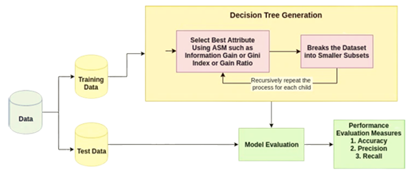

# Welcome to Mlocean Code Repository
Here you can find the source code to the our tutorials, posts and blog articles.
## Instagram Codes
### Decision Trees 
Introductory code for decision tree using sklearn and Prima Diabetes Dataset.

